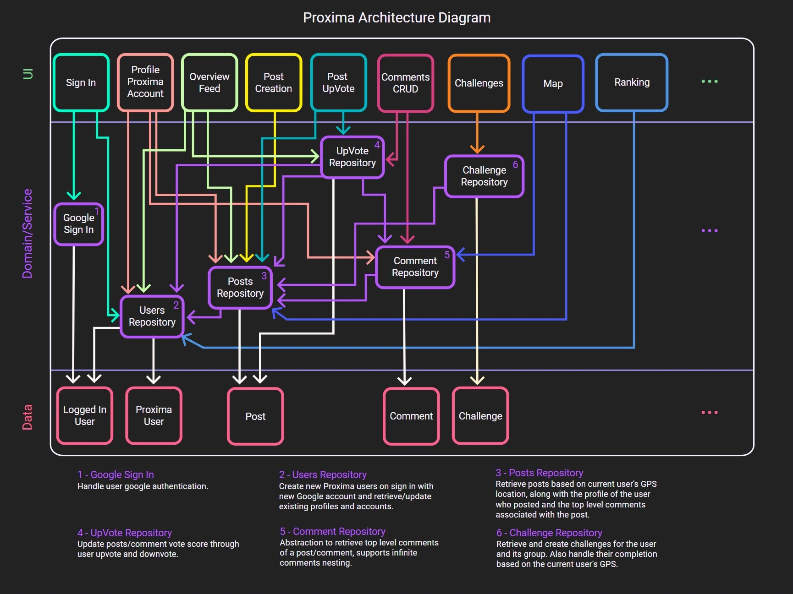

# Functional Requirements
Here are the functional requirements that we believe are necessary for the MVP to be successful.

### User Authentication
Users must be able to authenticate into their account to use the app. For this, we will use pre-existing infrastructure, such as Google Sign-in or other common OAuth providers.

### Post Creation
Users must be able to create posts. These can contain simple text or media, sucha as GIFs, photos or videos. These posts will have embedded location data. This will allow the users to share their experiences.

### Comment System
Users must be able to leave comments on posts. This will allow them to interact with posts that they see. They should be able to choose between seeing most recent or most popular comments first, as they prefer.

### Voting System
Users should be able to upvote or downvote posts and comments. That way, the other users are able to quickly discard posts that received a negative opinion from the community, and it also allows for challenges to be generated on interesting posts.

### Location-Based Feed
Users must be able to see in a feed all of the posts that were made inside of a 100m radius around their current position. This feed will have different sorting options:

- Hottest, which shows the most trending post first using a combination of recency and number of upvotes
- Top, which shows the most upvoted posts first
- Nearest, which shows the closest posts first
- Latest, which shows the most recent posts first

This allows the users to more easily find posts that are interesting to them.

### Offline Mode
Users must be able to see as much data as possible even when they are not online. Their user profile, own posts and comments and current challenges should be cached locally and always be accessible.

### Posts and comments management
Users should always be able see all of their own posts and comments in their profile page, and delete them if they want to. That way they can have control over their online image and can delete a post if they regret making it. Deleting a post automatically deletes all the comments and any information related to it.

### Challenges
Users get 3 challenges everyday. These are randomly picked from posts in their area. To complete these challenges, they have to travel to the post and open it. This gives the users a concrete mission that they can do every day.

### Centauri Points
Users gain Centauri points by completing challenges. These provide cosmetic improvements on their profile. Users can see how much points they have in their profile as well as in a leaderboard, where they can compare themselves to everyone. This makes it more interesting to use the app regularly, and improves engagement.

### Map Integration
Users should be able to see all the nearby posts, all of their own posts and all their challenges on a map. It should be simple to navigate back and forth from the map to the other pages. It should also be possible to seamlessly open the Google maps app to navigate to any post. This allows the user to precisely see where each post is, and also to know where to go to complete challenges. 

### Internal Architecture
The different screen viewmodels will communicate with different repositories to optain the data they need. These repositories talk with the database and obtain the live data. This can be seen in the app architecture diagram, in figure \ref{app_diagram}.

